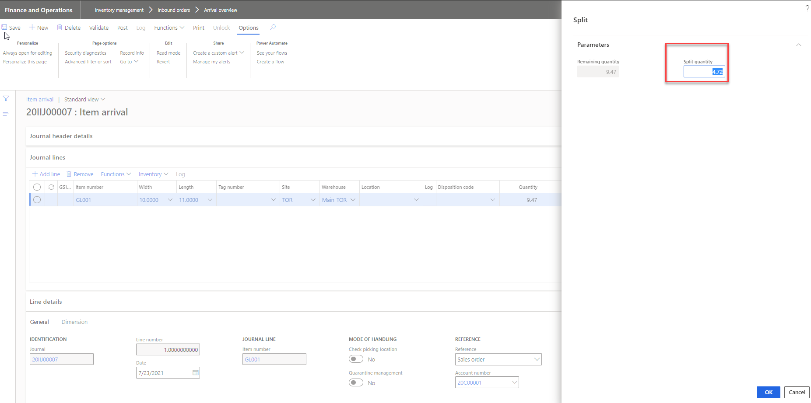

# FDD

FD\_117617\_ Price by actual rounding on return order received through item arrival

## Document Owners

CROWE

**Vaibhav Bansal**

## Document Status

Crowe Metal Accelerator

| Version | Description | Owner\(s\) | Date |
| :--- | :--- | :--- | :--- |
| 1.0 | Initial draft | Gagan Batra | 07/16/21 |

## Table of Contents

[Document Owners 2](file:///C:/Data/BATRAG/My%20Work/01%20-%20CMA%20Enhancements/CMA%2010.0.21%20Tasks/FD_117617_Price%20by%20actual%20rounding%20on%20return%20order%20received%20through%20item%20arrival.docx#_Toc78209556)

[Document Status 2](file:///C:/Data/BATRAG/My%20Work/01%20-%20CMA%20Enhancements/CMA%2010.0.21%20Tasks/FD_117617_Price%20by%20actual%20rounding%20on%20return%20order%20received%20through%20item%20arrival.docx#_Toc78209557)

[Table of Contents 3]()

[1. Introduction 4]()

[1.1. Overview of Proposed Solution 4]()

[1.2. Business Requirements 4]()

[2. Justification 5]()

[2.1. Current Functionality 5]()

[2.2. Workarounds Considered 7]()

[2.3. Alternative Enhancements Considered 7]()

[2.4. Enhancement Benefits 8]()

[3. Detailed Design Specifications 9]()

[3.1.1. Single tag return registration 9]()

[3.1.2. Multiple tag registration 10]()

[4. Security 12]()

[5. Data Migration 13]()

[6. Assumptions 14]()

[6.1. Configuration 14]()

[6.2. Cross-Functional Implications 14]()

[7. Scenarios & Examples 15]()

## 

|  |  |
| :--- | :--- |

## Justification

### Current Functionality

In current scenario, system allows to register the return quantity with price by actual but at the time of packing slip, system is not considering the actual quantity being registered instead populating packing slip quantity based on return order line quantity.

For example:

Item: GL001 having inventory unit ‘Ton’ and sales unit ‘Pc’.

Conversion factor: 1 Pc = 0.0471 T

At the time of sales order invoice posting, quantity picked is 4.75 T and quantity in Pcs is calculated as 100.85 Pc \(based on price by actual\). Packing slip and invoice has been posted with same quantity.

Now, customer returned the total quantity, so user has to registered 4.75 T from arrival overview form, but sales return order quantity is being updated as 101 \(because of Pcs are not allowed to be in decimal\).

Sales order created for price by actuals enabled on sales order line:

Actual quantity picked on mobile device.

Then on packing slip and invoice posted with quantity calculated based on actual quantity picked.

**Packing slip posting:**

Invoice Posting:

Now, create customer return order for quantity to be returned:

Arrival journal created from arrival overview. Update quantity on arrival journal i.e. actual quantity received.

Post the arrival journal, then on posting the packing slip from return order line or invoice, system picks the total quantity instead of calculating based on actuals registered.

### Workarounds Considered

N/A

### Alternative Enhancements Considered

N/A

### Enhancement Benefits

This extension provides the ability for user to register single and multiple tag against the return order line with price by actual enabled and further packing slip quantity will be calculated based on actual received so that return amount should match the original invoice amount.

This extension will support to register single or multiple tags registration \(by using arrival overview process\) with price by actuals enabled.

## Detailed Design Specifications

#### Single tag return registration 

In case of single tag sold to the customer with price by actuals enabled, and same tag is being retuned from the customer.  

Now on posting the arrival journal, it is required to update the ‘Picked quantity’ field on sales order line, like the same way system update ‘picked quantity’ field on sales order picking with the actual quantity picked.

And, it is required that system should calculate the packing slip quantity for return order line based on the actual quantity registered.

Note the fllowing:

* System should calculate packing slip quantity based on actual picked quantity only if value exist in picked quantity field on sales line.
* System should follow same logic for quantity calculation on packing slip form either open from return order or from sales order.
* User can use manual registration process from sales return order line or can follow arrival journal process.

#### Multiple tag registration

In And, further system should calculate the packing slip quantity for return order line based on the picked quantity updated on return registration.

Split the line on arrival journal for multiple tag registration.

Update the tag information and post the arrival journal.

On arrival journal posting, system splits the return order line. Here, it is required to update the ‘picked \(CMA\)’ field based on actuals quantity registered.

And, further packing slip and invoice posting quantity should be calculated based on actuals registered i.e. based on value in picked quantity field.

NOTE:

* In case there is no value in ‘Picked \(CMA\)’ field, then system should follow STD D365 logic for quantity update on packing slip posting screen.

## Security

_Does this design create new Forms or Reports?_

Yes ☐

No ☒

_If yes, new security privileges need to be created for Inquire \(read\) and Maintain \(edit\) access._

_Indicate the duties or roles which should have access and the development team will create new Privileges and associate them._

| Form/Report | Access Level | Duty\(s\) |
| :--- | :--- | :--- |
|  | Inquire \(read\) |  |
| Maintain \(edit\) |  |  |

## Data Migration

**New fields**

_Does this design add new fields\(s\) to a table that will require data import?_

Yes ☐

No ☒

_If yes, identify the associated data entity\(s\) which should be populated_

| New Field Name | Data Entity Name |
| :--- | :--- |
|  |  |
|  |  |

**New tables**

_Does this design add new table\(s\) which will require data import?_

Yes ☐

No ☒

_If yes, list the tables below and new data entity\(s\) will be created for each_

| New Table Name | New Data Entity Name |
| :--- | :--- |
|  |  |
|  |  |

## Assumptions

### Configuration

### Cross-Functional Implications

## Scenarios & Examples

Folloing are the scearios needs to be considered for testing:

* Test in CMC as well as in CMA company.
* Test with price by actuals enables sales order and sales return.
* Test with manual registration for sales return order line as well as registration from arrival overview.
* Test for single tag sold to customer and single tag returned
* Test for multiple tags sold to customer and multiple tags returned
* Test for multiple tags sold to customer and single tags returned
* Test with inventory unit ‘Mass’ and order unit ‘Pcs’ and vice-a-versa
* Test for Length and width control items, Length controlled items, and width control items

